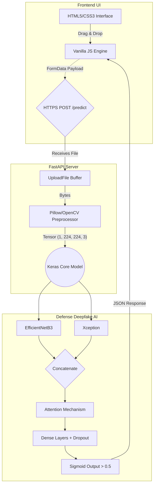
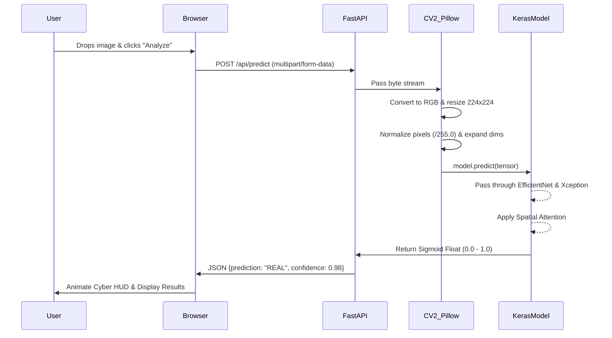

# Deepfake Detection System: Full-Stack Architecture Report

## 1. Executive Summary
The Deepfake Detection system is a robust, full-stack application designed to classify uploaded media as "REAL" or "FAKE" using a state-of-the-art ensemble Deep Learning architecture. The platform combines a high-performance ASGI-enabled Python backend with a stunning, modern, glassmorphic client frontend to deliver an exquisite and instantaneous user experience.

---

## 2. Technology Stack

### Artificial Intelligence & Data Pipeline
* **TensorFlow / Keras**: Core deep learning framework for compiling and executing the ensemble architecture (`EfficientNetB3` + `Xception`).
* **OpenCV (`cv2`) & Pillow (`PIL`)**: Rapid mathematical image preprocessing, channel color realignment, and matrix restructuring.
* **NumPy**: Tensor manipulation and dimension expansion.

### Backend Infrastructure
* **FastAPI**: A modern, hyper-fast, asynchronous web framework for building the central RESTful API endpoints.
* **Uvicorn**: Lightning-fast ASGI web server routing the network HTTP traffic to the FastAPI python instances.
* **python-multipart**: Underlying protocol library to interpret binary image payloads (`multipart/form-data`) pushed by the client browser.

### Frontend Client
* **HTML5**: Semantic tagging to structure the widget interfaces.
* **CSS3 (Vanilla)**: Features highly advanced aesthetic properties such as `backdrop-filter: blur()`, CSS custom variables, and `@keyframes` animations to create a luxurious glassmorphism effect without pulling bulky libraries like Bootstrap or Tailwind.
* **JavaScript (Vanilla)**: Handles the asynchronous component state, Drag-and-Drop Event Listeners (`dragover`, `drop`), `FileReader` API for the client preview, and the `Fetch` API to transmit packets to the backend seamlessly.

---

## 3. System Architecture & Component Mapping



### A. The Neural Architecture (`deepfake_detector_final.h5`)
The underlying AI model is a highly complex ensemble classifier:
1. **Base Extractors**: The system feeds the normalized image matrix simultaneously into two independent transfer-learning models:
   * **EfficientNetB3**
   * **Xception**
2. **Feature Fusion via Attention**: The spatial matrices extracted by both networks are concatenated (`Concatenate` layer). A custom-built dense artificial Attention Mechanism multiplies against the merged maps to teach the network *where* to look for inconsistencies (like localized algorithmic blurring or artifacting typical of deepfakes).
3. **Classification Head**: The tensor passes through rigorous `BatchNormalization` and `Dropout` layers to prevent overfitting before reaching a final `Dense(1, activation='sigmoid')` layer, which yields a decimal confidence coordinate bounding between `0.0` (FAKE) and `1.0` (REAL).

### B. The FastAPI Backend (`backend/main.py`)
1. **Initialization (`@app.on_event("startup")`)**: To optimize the API to respond in milliseconds, the heavy multi-megabyte Keras `.h5` model is instantiated strictly once into the server memory pool upon boot. 
   * *Critical Patches*: A customized layer override (`CustomDense`) was engineered to smoothly bypass `quantization_config` compatiblity bugs across varying TensorFlow execution states.
2. **Static Asset Mounting**: Uses FastAPI's `StaticFiles` plugin to mount the `frontend/` directory, natively hosting the client GUI without needing a separate web-layer like NGINX or Apache.
3. **API Routing Layer (`@app.post("/api/predict")`)**: An asynchronous receiver rigorously expecting valid MIME types (`image/jpeg`, etc.) directly into an `UploadFile` byte stream.

### C. The Visual Frontend (`frontend/`)
The frontend operates as a single-page application (SPA). Key features include:
1. **The Glass Box (`style.css`)**: Uses translucent semi-opaque containers (`rgba(255,255,255,0.05)`) over vibrant gradient spheres drifting softly in the background to command an atmosphere of high-end intelligence.
2. **Drag & Drop Workflow**: Intercepts native browser file-dropping to extract binary File blobs without forcing ancient `<input type="file">` popups. 

---

## 4. End-to-End Data Flow



The chronological lifecycle of a user interacting with the platform:

1. **User Interaction**: The user opens `http://localhost:8000` via web browser. Uvicorn effortlessly dispatches the HTML, CSS, and JS static files back to the client.
2. **Client Preparation**: The user drags `test_image.jpg` into the upload zone. `script.js` utilizes `FileReader` to project the image visually into the preview pane.
3. **Transmission Hook**: The user clicks **Analyze Media**. The frontend constructs a `FormData` object hooking the binary blob, disables the button, and launches a loading animation. A `POST` fetch request flies to `/api/predict`.
4. **Backend Ingestion**: FastAPI instantly accepts the `multipart` packet.
5. **AI Preprocessing Matrix Pipeline**:
   * Pillow reads the raw binary byte arrays back into a standard RGB object.
   * Converted to a multidimensional Numpy Tensor object representing pixels.
   * Passed to OpenCV's `resize()` strictly conforming the image to exactly `224x224` pixels.
   * Numpy maps all integer pixel values (`0` to `255`) to strict floats mapping `0.0` to `1.0` (`/255.0`).
   * Numpy broadens the dimension matrix from `(224, 224, 3)` to `(1, 224, 224, 3)` to trick the network into expecting a batch size of $1$.
6. **Inference Execution**: `model.predict(tensor_matrix)` fires using system CPU/GPU delegates.
7. **Verdict Translation**: The raw fractional sigmoidal variable (e.g., `0.043`) is evaluated against the `> 0.5` binary threshold. The server packs a JSON envelope resolving `{"success": true, "prediction": "FAKE", "confidence": "0.957"}` explicitly.
8. **Client Rendering**: `script.js` intercepts the JSON. If "FAKE", it injects ruby red warning colors (`var(--danger-color)`) and stretches the confidence width percentage dynamically over $1000$ms to signify danger to the user.

---

## 5. Deployment Instructions

### Prerequisites
* Python 3.9+ environment.

### Setup Process
1. Initialize the environment dependencies: `pip install -r backend/requirements.txt`.
2. Ensure the pre-trained deepfake model is housed correctly in the working directory `results_20260311_210339/deepfake_detector_final.h5`.
3. Launch the central ASGI server logic:
   ```bash
   uvicorn backend.main:app --host 0.0.0.0 --port 8000 --reload
   ```
4. Application resolves successfully on `http://localhost:8000`.
